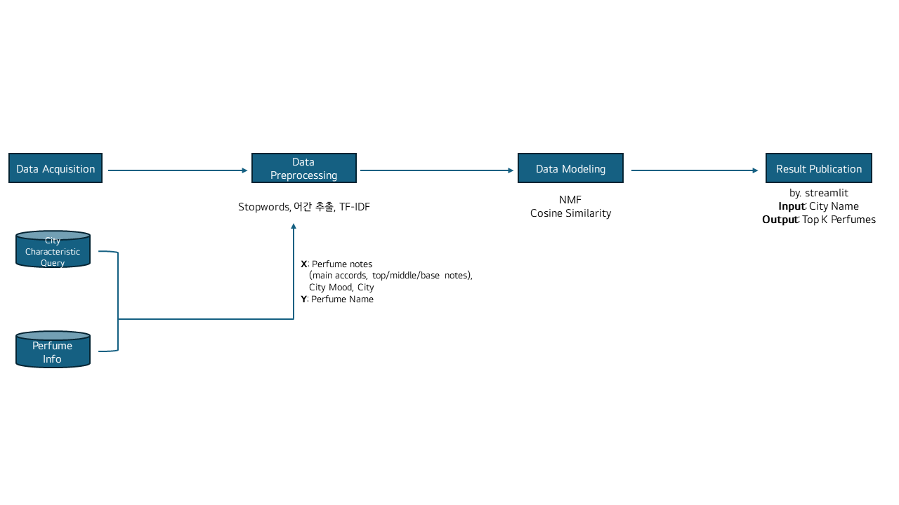
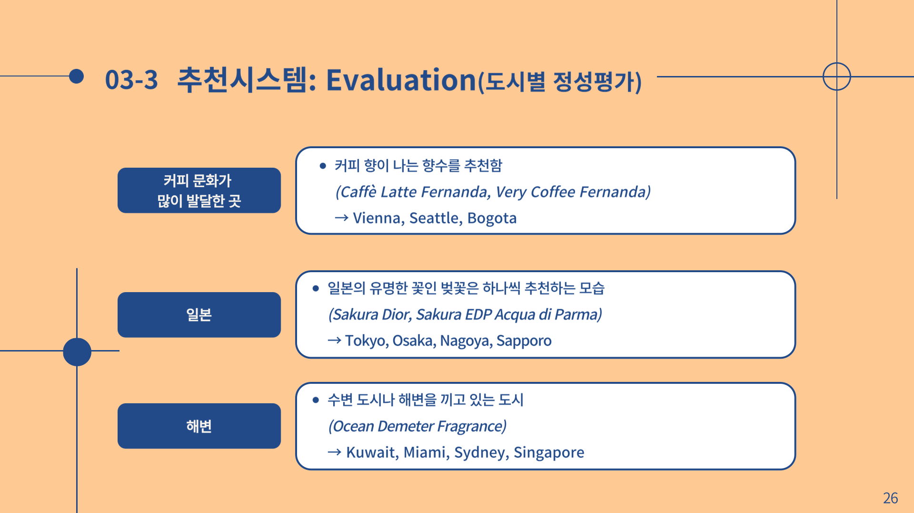
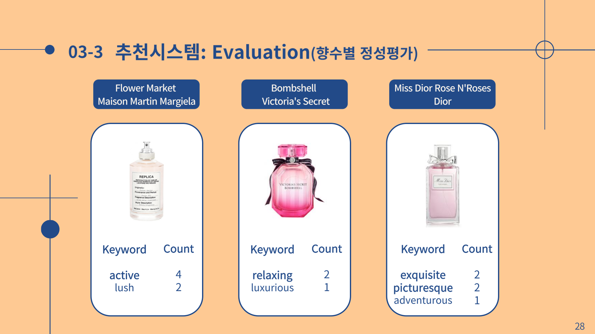

# dontpergetme
---
2024-1 서울여자대학교 데이터사이언스학과 머신러닝기반데이터분석 기말고사 프로젝트 5조: dontPERgetme
<div align="center">
<br>
  <br>
<table>
  <tr>
    <td align="center">
      <a href="https://github.com/sohds">
        
        <br />
        <sub>오서연</sub>
      </a>
        <br>
        <sub>서울여대 데이터사이언스학과 3학년</sub>
        <br>
        <sub>sohtks@swu.ac.kr</sub>
    </td>
    <td align="center">
      <a href="https://github.com/jinnypstar">
        
        <br />
        <sub>박서진</sub>
      </a>
        <br>
        <sub>서울여대 데이터사이언스학과 3학년</sub>
        <br>
        <sub>seoj1npark@swu.ac.kr</sub>
    </td>
    <td align="center">
      <a href="https://github.com/ksua0923">
        
        <br />
        <sub>김수아</sub>
      </a>
        <br>
        <sub>서울여대 데이터사이언스학과 3학년</sub>
        <br>
        <sub>ksua0923@swu.ac.kr</sub>
    </td>
  </tr>
</table>
</div>
<br>
- 프로젝트에 대해 궁금한 사항이 있으신 경우, 팀원의 이메일이나 <a href="https://open.kakao.com/o/sxM1nOwg" >카카오톡 오픈 채팅방</a>을 이용해 주세요.

<br>
<br>
<br>


## 프로젝트 주제 소개

### 문제 정의
***“특별한 여행의 추억을 향기로 간직할 수 있는 시스템의 부재”***

- 이러한 **개인화된 후각 경험**을 제공하는 추천 시스템이 없기 때문에, 여행자들은 여행지와의 지속적인 감정적 연결이 어려움
- 따라서, 여행지의 고유한 향기를 통해 여행의 추억을 강화하고, 감정적으로 몰입할 수 있는 **새로운 패러다임의 향수 추천 시스템**을 개발하고자 함

### 목표

- 심리적인 효과(프루스트 효과)를 기반으로 새로운 향수 추천 패러다임 제시

### y=f(x)

- y: top-K recommended perfumes
- f: our model - **DPGM**(Don’t PerGet Me: NMF + Cosine Similarity)
- x: perfume notes, city mood keyword, city name

### Pipeline



- Data Acquisition → Data Preprocessing → Data Modeling → Result Publication 순으로 프로젝트가 진행되었습니다.
- 아래에 더 상세한 설명을 원하실 경우, 원하는 프로세스에 클릭해 확인 해주세요.
    - <a href="https://github.com/ksua0923/dontpergetme/wiki/Data-Acquisition" >Data Acquisition</a>
    - <a href="https://github.com/ksua0923/dontpergetme/wiki/Data-Preprocessing" >Data Preprocessing</a>
    - <a href="https://github.com/ksua0923/dontpergetme/wiki/Data-Modeling" >Data Modeling</a>

<br>
<br>


## Results

- **평가 기준**
    - 정량평가 불가능해서 정성평가 실시
        1. 키워드와 도시가 잘 어울리는지 평가 (팀원 평가)
        2. 임의로 향수 선정해 그 향수가 대표하는 키워드가 무엇일지 확인
            - 향수가 포함되어있는 행을 찾고, 그 행에서 키워드를 뽑아 키워드가 몇 번 나왔는지 counts해서 평가하는 방식
<div align="center">


</div>

<br>
<br>

## 레포지토리 폴더 설명

```
+---Data
|   +---Crawling
|   |   \---dataset
|   |       +---perfume-info-raw
|   |       +---travel-destination
|   |       \---url
|   +---preprocess-data
|   \---Prompting
|       \---dataset
+---Model
|   +---Visualization
|   \---__pycache__
\---streamlit
    +---data
    +---forapp
```


- **Data**
    - Crawling
        - dataset : 향수 데이터와 여행지 데이터를 담고 있음
            - perfume-info-raw : 향수 정보 데이터를 담고 있음
            - travel-destination : 여행지 관련 데이터를 담고 있음
            - url : 향수 크롤링을 위한 url 목록을 담고 있음
    - preprocess-data : 데이터 전처리와 관련한 파일을 담고 있음
    - Prompting : 프롬프팅 관련 파일을 담고 있음
        - dataset : 여행지 무드, 쿼리와 관련한 파일을 담고 있음
    
    Data는 데이터를 수집 및 전처리를 위한 레포지토리로, 크롤링, 데이터 수집, 전처리, 그리고 특정 도메인(향수 정보, 여행지 정보)에 대한 데이터가 있습니다.
    
- **Model**
    - Visualization : 데이터 시각화와 관련한 파일들을 담고 있음 (EDA)
    
    Model은 데이터 분석 및 모델링 작업을 수행하기 위한 레포지토리로, 데이터 시각화, 모델링, 추천 시스템 구축 및 텍스트 전처리에 관한 파일이 있습니다.
    
- **streamlit**
    - forapp : streamlit에서 활용되는 이미지, csv 파일 저장되는 공간
    
    streamlit은  demo를 위한 streamlit 구축을 수행하기 위한 레포지토리로, streamlit을 사용하여 향수 추천 시스템 및 여행지 정보를 제공하는 웹을 구축하기 위한 이미지 파일, 코드에 관한 파일이 있습니다.
    

<br>
<br>

## 데모 실행 방법

🌐 **Web:** [dontpergetme-recommendation.streamlit.app](https://dontpergetme-recommendation.streamlit.app/)


- 해당 데모는 웹 페이지와 로컬로 실행하실 수 있습니다.

- 로컬로 실행할 경우, 다음 스텝을 따라해 주세요.
    1. OpenAI에서 API Key를 발급 받아야 합니다.
    2. API Key 발급 후, 'streamlit/forapp/’ 경로에 ‘ChatGPT_api_key.json’ 파일을 생성해 API Key를 넣어주세요.
        
        ```python
        {
            "API_KEY" : "your-openai-api-key",
            "API_NAME" : "for-streamlit"
        }
        ```
        
    3. 레포지토리를 git clone 한 다음 해당 스크립트를 터미널로 실행시켜야 합니다.
        
        ```python
        streamlit run app_local.py
        ```
        
    4. 이제 local port로 실행되는 모습을 확인할 수 있습니다. 브라우저를 통해 열어야 하며, local port 링크를 따라 들어가세요.
 
<br>
<br>

## 향후 연구 방향

- 궁극적으로 대화형 향수 추천 시스템(CRS, *Conversational Recommendation System*)를 할 수 있도록 프로젝트를 설계할 예정
    - 직접 LLM의 체크포인트를 불러와서 실험을 진행할 예정 (ChatGPT API가 아닌, Llama 3.1과 같은 오픈소스 LLM Checkpoint 활용 예정)
    - LLM과 RAG를 연결해, LLM의 답변을 통해 여행지 Mood와 비슷한 키워드를 추출
        - RAG로 불러올 DB를 위해 미리 여행지와 관련된 정보들을 크롤링 할 예정
    - 향수 노트들의 모음을 미리 텍스트 임베딩 시켜두고, 여행지 Mood 키워드들도 텍스트 임베딩을 시켜 유사도를 통해 추천할 향수를 추출
